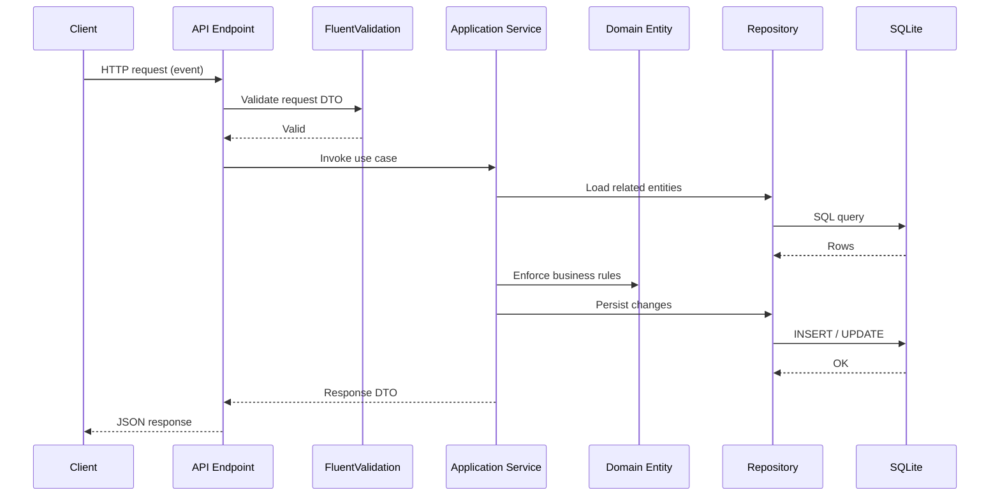

# Mini-Splitwise

[](https://github.com/giovannimedici/Mini-Splitwise/actions/workflows/ci.yml)

A lightweight REST API for splitting shared expenses among friends — inspired by Splitwise, built as a clean-architecture showcase for technical interviews and team onboarding.

## Overview

Mini-Splitwise lets you register members, create expense-sharing groups, record who paid for what, and calculate who owes whom. It solves the common problem of tracking informal debts in roommates, trips, or dinner outings without spreadsheets or manual math.

The project prioritizes **clarity over features**: a recruiter or new teammate can understand the design, run the stack locally, and hit the API in under five minutes.

## Architecture

The API follows a **layered, request-driven pipeline**. Each HTTP request flows through validation, application services, domain rules, and persistence — with no external message broker.



ASCII equivalent:

```
Client
  │  HTTP POST /expenses
  ▼
API Endpoint  ──►  FluentValidation  ──►  Application Service
                                              │
                                              ▼
                                         Domain Entity
                                         (business rules)
                                              │
                                              ▼
                                         Repository  ──►  SQLite
```

**Key flow (expense creation):**

1. Client sends a `POST /expenses` request.
2. The endpoint validates the DTO with FluentValidation.
3. `ExpenseService` loads the group and members, then calls `Expense.Create()` in the domain layer.
4. `ExpenseRepository` persists the entity via EF Core.
5. A `ExpenseResponseDto` is returned as `201 Created`.

## Tech Stack

| Layer | Technology | Version |
|-------|-----------|---------|
| Runtime | .NET | 8.0 |
| Web framework | ASP.NET Core Minimal APIs | 8.0 |
| API docs | Swashbuckle (Swagger) | 6.6.2 |
| Authentication | JWT bearer tokens (`QuickJwt.AspNetCore`) | 1.0.2 |
| Validation | FluentValidation | 12.1.1 |
| ORM | Entity Framework Core | 8.0.28 |
| Database | SQLite | via EF Core provider 8.0.28 |
| Naming convention | EFCore.NamingConventions (snake_case) | 8.0.3 |
| Testing | xUnit + NSubstitute | 2.5.3 / 5.3.0 |
| Containerization | Docker + Docker Compose | — |

## Quick Start

### Prerequisites

- [Docker](https://docs.docker.com/get-docker/) and [Docker Compose](https://docs.docker.com/compose/) installed
- *(Optional)* [.NET 8 SDK](https://dotnet.microsoft.com/download/dotnet/8.0) for local development without Docker

### Run with Docker (recommended)

```bash
git clone https://github.com/giovannimedici/Mini-Splitwise.git
cd Mini-Splitwise
docker compose up --build
```

Wait until the API is ready, then open Swagger UI:

```
http://localhost:8080/swagger
```

### Authentication

All `/members`, `/groups`, and `/expenses` endpoints require a JWT bearer token. The API validates tokens signed with the symmetric key in `Jwt:Key`; it validates the signature and expiration, but does not require an issuer, audience, or specific claims.

For local development, a key is configured in `appsettings.Development.json`. Override it outside development with the `Jwt__Key` environment variable:

```bash
export Jwt__Key="replace-with-a-long-random-secret"
dotnet run --project src/Minisplitwise.API
```

The API deliberately does not expose login or token-issuance endpoints. Obtain a valid, non-expired HS256 token from your identity provider or token-generation tool using the configured key, then set it once for the examples below:

```bash
export TOKEN="YOUR_SIGNED_JWT"
```

### First authenticated request

Verify the API is alive by listing members (returns an empty array on a fresh database):

```bash
curl -s http://localhost:8080/members \
  -H "Authorization: Bearer $TOKEN"
```

Expected response:

```json
[]
```

### Run locally without Docker

```bash
dotnet restore
dotnet run --project src/Minisplitwise.API
```

The API starts at `http://localhost:5139` (see `launchSettings.json`). Swagger is available at `/swagger` in Development.

## Project Structure

```
Mini-Splitwise/
├── src/
│   ├── Minisplitwise.API/           # HTTP entry point
│   │   ├── Endpoints/               # Minimal API route definitions
│   │   ├── Middlewares/             # Global exception handling
│   │   └── Extensions/              # Startup helpers (migrations)
│   ├── Minisplitwise.Application/   # Use cases and orchestration
│   │   ├── Services/                # Business workflows
│   │   ├── Validators/              # Input validation (FluentValidation)
│   │   └── */                       # DTOs grouped by feature
│   ├── Minisplitwise.Domain/        # Core business model
│   │   ├── Entities/                # Member, Group, Expense
│   │   ├── Interfaces/              # Repository contracts
│   │   └── Exceptions/              # Domain and not-found errors
│   └── Minisplitwise.Infrastructure/ # External concerns
│       ├── Data/                    # DbContext, EF configurations
│       ├── Data/Repositories/       # Repository implementations
│       └── Migrations/              # EF Core schema migrations
├── tests/
│   └── Minisplitwise.Tests/         # Unit tests (Domain + Application)
├── Dockerfile
├── docker-compose.yml
└── Mini-Splitwise.sln
```

| Layer | Responsibility |
|-------|---------------|
| **API** | Routing, Swagger, middleware, dependency injection wiring |
| **Application** | Use-case logic, DTO mapping, input validation |
| **Domain** | Entities, invariants, repository interfaces — zero infrastructure deps |
| **Infrastructure** | EF Core, SQLite, repository implementations |

## Design Decisions

- **Clean Architecture / layered separation** — Domain has no framework dependencies; infrastructure is swappable behind interfaces.
- **Minimal APIs over controllers** — Fewer boilerplate files; endpoints are grouped by feature in static classes.
- **FluentValidation + domain exceptions** — Input shape is validated at the edge; business rules (e.g. "a group needs at least 2 members") live in domain entities and throw `DomainException`.
- **SQLite + Docker volume** — Zero external database setup; data persists across container restarts via the `sqlite-data` volume.
- **Auto-migrations in Development** — Schema is applied on startup so `docker compose up` works without manual migration steps.
- **Equal-split payment algorithm** — Debts are split evenly among `sharedWith` members plus the payer; a greedy settlement algorithm minimizes the number of transfers.
- **Snake_case in the database** — Column names follow PostgreSQL conventions via `EFCore.NamingConventions`, easing a future DB migration.

## How to Test

All examples assume the API is running at `http://localhost:8080`. Run them in order — later steps depend on IDs returned by earlier ones.

### 1. Create members

```bash
curl -s -X POST http://localhost:8080/members \
  -H "Content-Type: application/json" \
  -H "Authorization: Bearer $TOKEN" \
  -d '{"name":"Alice","email":"alice@example.com","birthDate":"1990-01-15"}'

curl -s -X POST http://localhost:8080/members \
  -H "Content-Type: application/json" \
  -H "Authorization: Bearer $TOKEN" \
  -d '{"name":"Bob","email":"bob@example.com","birthDate":"1992-06-20"}'
```

Save the `id` values from each response as `ALICE_ID` and `BOB_ID`.

### 2. List all members

```bash
curl -s http://localhost:8080/members \
  -H "Authorization: Bearer $TOKEN"
```

### 3. Create a group

Requires at least two member IDs.

```bash
curl -s -X POST http://localhost:8080/groups \
  -H "Content-Type: application/json" \
  -H "Authorization: Bearer $TOKEN" \
  -d '{"name":"Trip to the beach","memberIds":["ALICE_ID","BOB_ID"]}'
```

Save the returned `id` as `GROUP_ID`.

### 4. Add a member to a group

```bash
# Create a third member first, then add them:
curl -s -X POST http://localhost:8080/members \
  -H "Content-Type: application/json" \
  -H "Authorization: Bearer $TOKEN" \
  -d '{"name":"Carol","email":"carol@example.com","birthDate":"1988-03-10"}'

curl -s -X POST http://localhost:8080/groups/add-member \
  -H "Content-Type: application/json" \
  -H "Authorization: Bearer $TOKEN" \
  -d '{"groupId":"GROUP_ID","memberId":"CAROL_ID"}'
```

### 5. Create an expense

Alice pays $90 for dinner, shared with Bob and Carol.

```bash
curl -s -X POST http://localhost:8080/expenses \
  -H "Content-Type: application/json" \
  -H "Authorization: Bearer $TOKEN" \
  -d '{
    "description": "Dinner",
    "amount": 90.00,
    "date": "2026-07-01T20:00:00",
    "groupId": "GROUP_ID",
    "paidById": "ALICE_ID",
    "forEveryone": false,
    "sharedWithIds": ["BOB_ID", "CAROL_ID"]
  }'
```

### 6. List expenses by group

```bash
curl -s http://localhost:8080/expenses/GROUP_ID \
  -H "Authorization: Bearer $TOKEN"
```

### 7. List expenses for a member in a group

Shows each member's share (amount divided equally).

```bash
curl -s http://localhost:8080/expenses/BOB_ID/GROUP_ID \
  -H "Authorization: Bearer $TOKEN"
```

### 8. Calculate settlement payments

Returns who should pay whom to settle all debts in the group.

```bash
curl -s http://localhost:8080/expenses/GROUP_ID/payments \
  -H "Authorization: Bearer $TOKEN"
```

### Run unit tests

```bash
dotnet test
```

## Known Limitations

- **No identity or token-issuance endpoints** — The API validates bearer tokens but does not authenticate users, issue tokens, or apply authorization policies/roles. Integrate an identity provider before production use.
- **No message broker** — Processing is fully synchronous; there is no event bus or background consumer.
- **SQLite only** — Single-file database; not designed for high concurrency or horizontal scaling.
- **Equal splits only** — Expenses are divided evenly; custom percentages or itemized splits are not supported.
- **`forEveryone` flag is stored but not enforced** — You must still provide `sharedWithIds` explicitly.
- **No update or delete endpoints** — Members, groups, and expenses cannot be modified after creation.
- **Migrations run only in Development** — Production deployments require a separate migration strategy.
- **Docker healthcheck may fail** — The `aspnet:8.0` runtime image does not include `curl` by default; the healthcheck in `docker-compose.yml` may report `unhealthy` even when the API is running. Use `curl http://localhost:8080/swagger/index.html` from the host to verify.
- **No pagination** — `GET /members` and expense listing endpoints return full result sets.

## License

This project is provided for evaluation and learning purposes.
